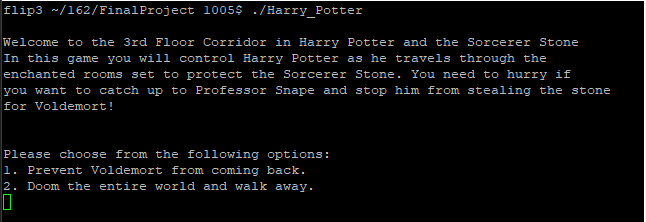
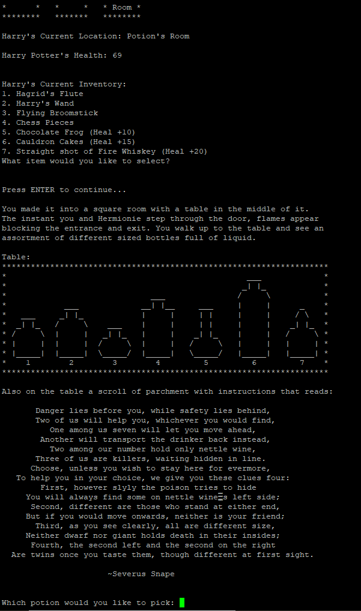

# Harry Potter and the Sorcerer's Stone Maze
A text-based game based on Harry Potter and the Sorcerer's Stone 3rd floor underground chambers.

## Purpose:
Demonstates understanding of memory management, inheritance and polymorphism, linked classes, and STL containers. Written in C++.

## Game Description:
The player begins with an opening description of the game and invites the player to either begin the game or walk away. Assuming the user wishes to play, they will enter 1 in and instructions on how to play the game will display.

After every single action in the game, besides "run away and quit the game", a map showing you the rooms (Marauders Map), Harry's Current Location, Harry's Health, and Current Inventory is displayed. The use can not have greater than 10 items in their inventory at a time and the first 4 items (Hagrid's Flute, Harry's Wand, Flying Broomstick, and Chess Pieces) will never disappear from the inventory. 

There are 4 options in every room:

1) Look around the room

2) Use item from inventory

3) Move on to the next room

4) Run away and quit the game

You must solve the puzzle for each of the rooms before you will be able to successfully complete the game.
Example of Room Puzzle:

At the end of the game you have the option to play the game again or quit the program.

GOOD LUCK!!

## Development Process:
This project was one of the first programs that I developed in the program that required me to actually design and develop the project on my own with limited guidelines. The project requirement were that the game needed to be a one-player, texted-based game where the player can move through spaces to get items and accomplish goals. The design of the game had to include pointer-linked spaces between rooms/locations while keeping track of the users location. The user also had to have an inventory that they could interact with to use items to proceed through the game. The final requirement was that the game had to have a "time" requirement, for instance the user had a maximum number of steps they could take or the user's character had a health system that decreased from space to splace. With these requirements in mind, the first thing that I wanted to do was to come up with a theme for the game and develop the process from there. After landing on a Harry Potter theme, I had to come up with a design for the room arrangement and also what items that I would need. After writing out the project classes and functions of those classes, I was able to write out the code. It took a little bit to debug as I was still relatively new to using C++ but overall the project development went smoothly.

## How To Run the Game
//To compile using the makefile
$ make

//To run after compiling
$ ./Harry_Potter
